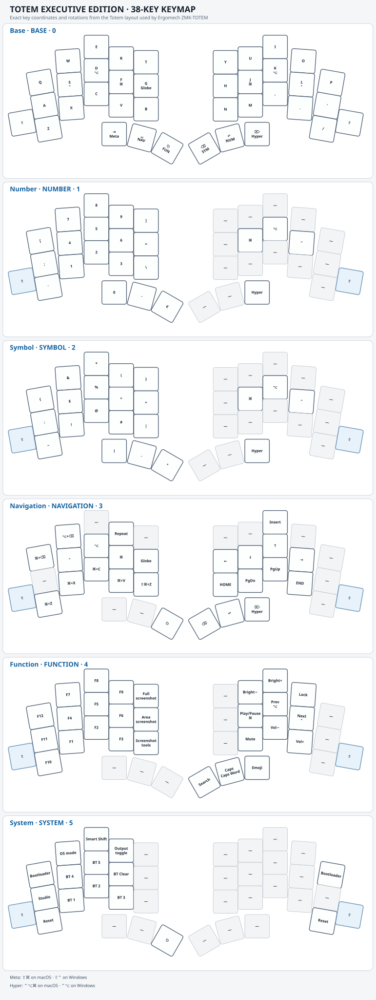

# Totem Executive Edition · 38-key keymap

Personal ZMK configuration for the [Ergomech Totem Executive Edition](https://ergomech.store/shop/totem-executive-edition-522). It follows the board, shield, and build setup from [Ergomech's ZMK-TOTEM firmware](https://github.com/ergomechstore/ZMK-TOTEMIST), with the current keymap adapted to the Totem and only the custom key behaviors that map needs. This target has no display; the configuration adds no display driver or display UI.

Keymap scheme

## Keymap design

The six-layer map keeps QWERTY letters on Base and uses home-row holds for modifiers. The scheme uses the actual key coordinates, rotations, and matrix order from the Totem module selected by [Ergomech's ZMK-TOTEM manifest](https://github.com/ergomechstore/ZMK-TOTEMIST/blob/main/config/west.yml); the labels come from this repository's `config/totem.keymap`. It shows ten top-row keys, ten home-row keys, twelve bottom-row keys, and six thumb keys. The board layout and matrix mapping remain Ergomech's.

| Layer | Label | Index | Role |
| --- | --- | ---: | --- |
| Base | BASE | 0 | QWERTY typing, home-row modifiers, and thumb layer access |
| Number | NUM | 1 | Digits, brackets, and number-row symbols |
| Symbol | SYM | 2 | Punctuation and shifted symbols |
| Navigation | NAV | 3 | Editing shortcuts, cursor movement, and paging |
| Function | FUN | 4 | Function keys, media, host screenshot/lock shortcuts, search, and emoji input |
| System | SYS | 5 | OS mode, Smart Shift, output, Bluetooth profiles, Studio, bootloader, and reset |

On Base, Space, Escape, Backspace, and Return hold NAV, FUN, SYM, and NUM respectively. Tab holds the OS-aware Meta chord; Delete holds Hyper. Space + Return toggles NAV, and Escape + Return toggles SYS. On NAV and SYS, the Escape thumb returns to Base.

## OS-aware keys and custom behaviors

The SYS layer's **OS** key switches between macOS and Windows mode for the active Bluetooth profile. Each of the five Bluetooth profiles keeps its own mode, saved in settings; new profiles start in macOS mode. Windows mode swaps Control and GUI/Command for ordinary keycodes and embedded chords. Shift and Alt do not swap. Globe sends Control + Windows in Windows mode.

OS-aware chord keys choose their host-specific shortcut directly:

| Key | macOS | Windows |
| --- | --- | --- |
| FUN + T · Full screenshot | Shift + Command + 3 | Windows + Print Screen |
| FUN + G · Area screenshot | Shift + Command + 4 | Alt + Print Screen |
| FUN + B · Screenshot/recording controls | Shift + Command + 5 | Windows + Shift + S |
| FUN + O · Lock | Control + Command + Q | Windows + L |
| FUN + Delete · Emoji picker | Control + Command + Space | Windows + period |
| Base + Tab hold · Meta | Shift + Command | Shift + Control |
| Base/NAV + Delete hold · Hyper | Control + Option + Command | Control + Alt |

The `screen_*` behavior names refer to host key combinations. They do not control or require a keyboard display.

**Smart Shift** toggles sentence-aware capitalization. **Caps Logic** sends Caps Lock when tapped and holds Caps Word. The custom `os_mode`, `smart_modifier`, and `smart_shift` behaviors provide the keymap-specific logic; the underlying Totem board and shield definitions remain from Ergomech.

## System layer

The left-hand **R** position toggles the selected output (`OUT_TOG`). The Bluetooth controls select profiles 0–4 and clear Bluetooth settings. The outer top-row keys enter the bootloader; SYS also includes Studio unlock and settings reset. RGB controls are omitted because this configuration does not use RGB.

The build matrix produces `totem_left` with ZMK Studio over USB, `totem_right`, and `settings_reset` for the Seeed XIAO BLE. Settings reset clears saved settings, including Bluetooth pairings and per-profile OS mode; flash the reset image to both halves, then restore the normal left and right firmware.

For source-controlled remapping, edit [`config/totem.keymap`](config/totem.keymap). For runtime remapping, unlock ZMK Studio from SYS on the left half. Studio edits are stored on the keyboard; restore stock settings in Studio before expecting source keymap changes to replace a saved Studio map.
